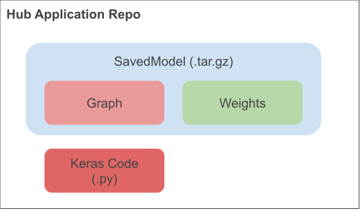

# Keras/Hub Applications

This shows how to use [TensorFlow Hub](tensorflow.org/hub) and Keras to build maximally reusable ML.

We share a version of DenseNet which is based on code in `keras-applications`.



This offers two ways to use the application:
  * *code+weights:* original Keras Applications method, use this if you're using Keras by cloning the repo and importing the python.
  * *graph+weights:* no need to clone _any_ code, no need to use Keras.  Just use `hub.load` and call the module.

## Example use
_Note: no need to clone any code:_
```python
import tensorflow_hub as hub

module = hub.load('https://github.com/jharmsen/hub-application/releases/download/v1/densenet121_weights_tf_dim_ordering_tf_kernels_notop.tar.gz')

output = module(tf.random.normal(1, 32, 32, 3))
```

Read the original documentation at: https://keras.io/applications/

## Testing
```
python -m pytest tests/
```
