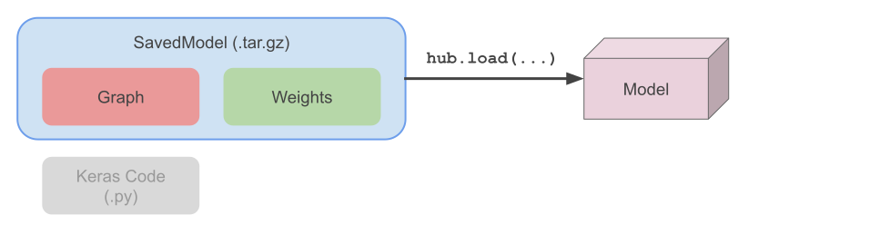
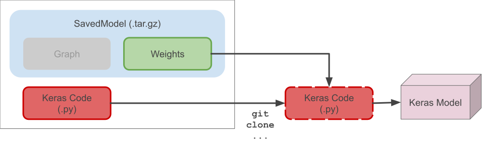

# Hub Applications
## Overview

This shows how to use [TensorFlow Hub](tensorflow.org/hub) and Keras to build maximally reusable ML.

This repo builds and shares a pretrained DenseNet121 for feature extraction (forked from [DenseNet](https://github.com/keras-team/keras-applications/blob/master/keras_applications/densenet.py) code in `keras-applications`).


## Use cases
There are two high-level ways to use a Hub Application:
  * *graph+weights:* no need to clone _any_ code, no need to use Keras.  Just use `hub.load` and call the module.
  * *code+weights:* original Keras Applications method, use this if you're using Keras by cloning the repo and importing the python.
  
### Try it!
Play around with the code:

[](https://colab.research.google.com/github/jharmsen/hub-application/blob/master/Hub_Application_Usage.ipynb)

Run with TensorFlow Serving:

[](https://console.cloud.google.com/cloudshell/editor?shellonly=true&cloudshell_image=gcr.io/cloudrun/button&cloudshell_git_repo=https://github.com/jharmsen/hub-application.git)

### Usage: graph+weights
In this case we use TF-Hub and SavedModel directly - _no need to clone any code_ or even be using Keras:
```python
import tensorflow_hub as hub

module = hub.load('https://github.com/jharmsen/hub-application/releases/download/v1/densenet121_weights_tf_dim_ordering_tf_kernels_notop.tar.gz')

output = module(tf.random.normal(1, 32, 32, 3))
```



Pros
  * No model code needed
  * Can be used across TF ecosystem (e.g., Sonnet, other languages, etc...)
  * Can be easily used in Keras with `hub.KerasLayer`
  
Cons
  * Less flexibility without full model code


### Usage: code+weights
In this case the Keras model code is cloned and produces a `keras.Model` whose weights are loaded from the SavedModel.

```shell
$ pip install git+https://github.com/jharmsen/hub-application.git
```

```python
from hub_application import densenet
...
model = densenet.DenseNet121()
```



Pros
  * Full flexibility in modifying code
  * Produces a complete `keras.Model`

Cons
  * Only applicable if user is using python & Keras

## Building a Hub Application
1. Export your `keras.Model` with `tf.saved_model.save` to produce the SavedModel .tar.gz ([example notebook](./Export_DenseNet121_No_Top.ipynb))
1. Upload SavedModel as a [release binary file](https://help.github.com/en/articles/creating-releases)
1. Add functionality in your `keras.Model` constructor to
    1. Download SavedModel with `hub.resolve`
    1. Load weights using `keras.Model.load_weights`

See an [example constructor here](https://github.com/jharmsen/hub-application/blob/04d9d338bcb01bf5ed79c1a3fbbe433935e2f223/hub_application/densenet.py#L229-L237).


## Testing
```
python -m pytest tests/
```
